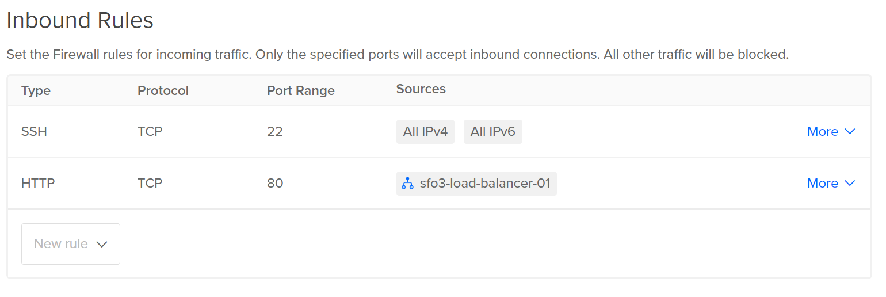

# 2420 Assignment 2

## Distributing HTTP Traffic to Servers With Load Balancing

**Simon Freeman**
**A01074210**

## Setup

This assignment will require several things to set up:
- VPC
- At least 2 Droplets
- Load Balancer
- Firewall (DigitalOcean Cloud Firewall)

**Create a VPC in Digital Ocean**

**Create two droplets in Digital Ocean**

When creating them, make sure to give them both the same tag, and that they use the VPC network you created. In this example, both droplets have the **Web** tag.

**Create a load balancer in Digital Ocean**

Make sure that the load balancer is connected to the two droplets by using the tag associated with the droplets. The IP of the load balancer address will be used to visit content from the droplet servers.

**Create a firewall in Digital Ocean**

Add an additional inbound rule for HTTP and make the source the load balancer that was created. Apply the firewall rules to the droplets by using the tag associated with the droplets.

Once you have completed all these steps, **your setup is complete.**