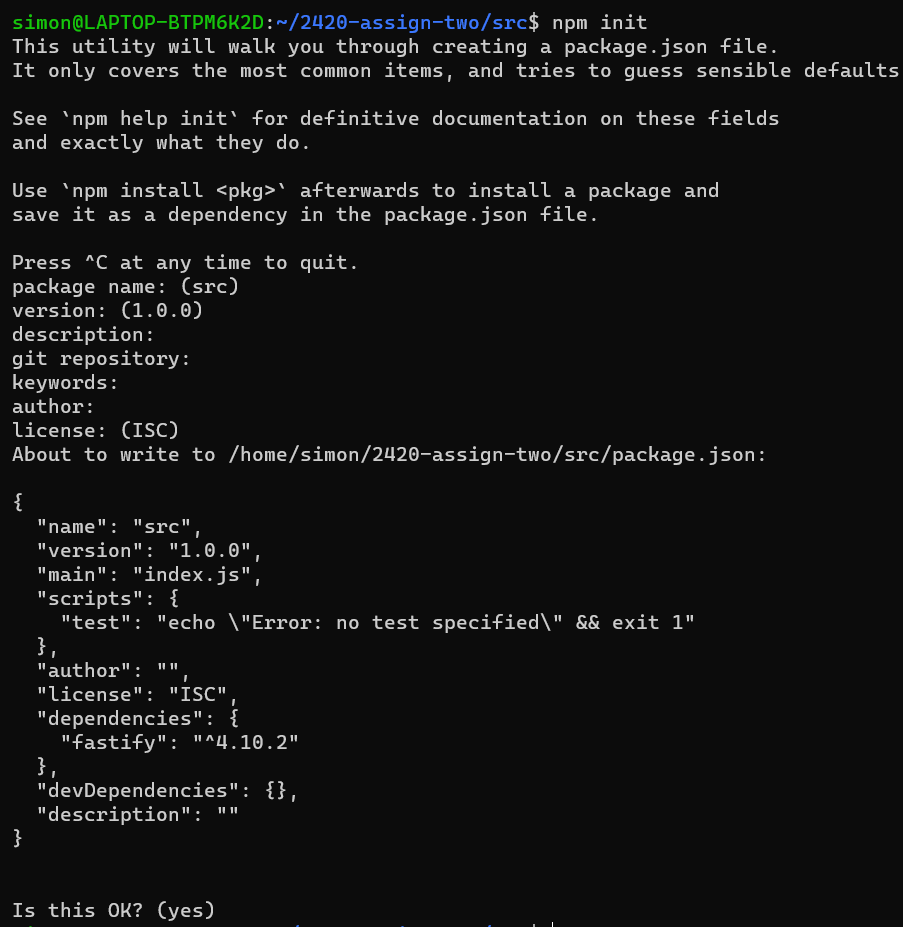
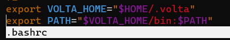
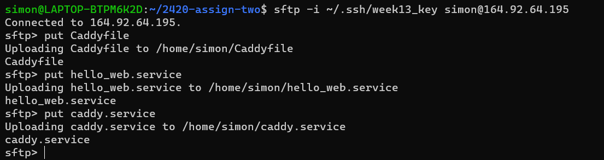

# 2420 Assignment 2

## Distributing HTTP Traffic to Servers With Load Balancing

**Simon Freeman**
**A01074210**

**Load Balancer IP to test my server:** http://146.190.15.205/

**If you want to copy paste it into the browser yourself:** 146.190.15.205

### Setup

This assignment will require several things to set up:
- VPC
- At least 2 Droplets
- Load Balancer
- Firewall (DigitalOcean Cloud Firewall)

**Create a VPC in Digital Ocean**


**Create two droplets in Digital Ocean**

When creating them, make sure to give them both the same tag, and that they use the VPC network you created. In this example, both droplets have the **Web** tag.


**Create a load balancer in Digital Ocean**

Make sure that the load balancer is connected to the two droplets by using the tag associated with the droplets. The IP of the load balancer address will be used to visit content from the droplet servers.


**Create a firewall in Digital Ocean**

Add an additional inbound rule for HTTP and make the source the load balancer that was created. Apply the firewall rules to the droplets by using the tag associated with the droplets.


Once you have completed all these steps, **your setup is complete.**

### Installing Web Servers

Once you have created regular users for each of your droplets, install a web server on **both of them**. In the context of this example, **Caddy** is being used. Make sure to not configure web servers yet.

Download the .tar.gz file for x86_64 of caddy by using the following command:
 ```bash
  wget https://github.com/caddyserver/caddy/releases/download/v2.6.2/caddy_2.6.2_linux_amd64.tar.gz
  ```

You should see something similar to this appear once it's been downloaded, and the archived file should appear be in your server:


To extract the contents of the download, use the following command:

```bash
tar xvf caddy_2.6.2_linux_amd64.tar.gz
```

Once extracted, you should have a LICENSE, README.MD, and caddy in the location in which you extracted caddy:


Make sure to change the caddy file’s owner and group to root:

```bash
sudo chown root: caddy
```

Copy the caddy file to the bin directory:

```bash 
sudo cp caddy /usr/bin/ 
```


**Repeat all of these steps in your other droplet server.**

### Writing a web app

On your local machine (in WSL if you are on Windows) create a directory. In this example the directory is named `2420-assign-two`. Inside the directory, create 2 more directories called `html` and `src`:

```bash
mkdir 2420-assign-two
cd 2420-assign-two
mkdir html && mkdir src
```


Inside the `html` directory, create an index.html page. 

```bash
cd 2420-assign-two
cd html
vim index.html
```
In this example, the index.html page looks like this: 


Inside the `src` directory, create a new node project with the following command:

```bash
npm init
```



When prompted for package name, description, entry point, etc, press enter to skip or keep everything as default. 

Afterwards, install fastify:

```bash
npm i fastify
```

Output of the command will look like this:


Afterwards, create an `index.js` file in your `src` directory. Add in this fastify hello world example code:

```bash
vim index.js

```

```bash

const fastify = require('fastify')({ logger: true }) 


fastify.get('/', async (request, reply) => {
  return { hello: 'Server x' }
})

const start = async () => {
  try {
    await fastify.listen({ port: 3000 })
  } catch (err) {
    fastify.log.error(err)
    process.exit(1)
  }
}
start()
```

**Note**: to complete the rest of the steps, the code will need to be altered slightly. The code alteration will be demonstrated in the following steps **(step 8).**

Afterwards, test that your server is working locally. You can do this with the following node command:

```bash
node index.js
``` 


This will produce a url that directs to your local server (In this case it is http://127.0.0.1:5050). Type this url into your browser of choice to see if it is working properly. In this example, the server looks like this:


Once you've tested your server locally, you can move the `html` and `src` directory to both of your servers. You can do this with the `sftp` and `put` commands.


### Writing the Caddyfile

Write the Caddyfile on your local machine. 

```bash
vim Caddyfile
```

In addition to having code for a basic server block, a reverse proxy server will also be added to the Caddyfile. 

The reverse proxy should forward localhost:5050 (http:/127.0.0.1:5050).

This allows a user who types /api after the url to load the `hello: 'Server x'` from line 6 of the **index.js** onto the browser.

It should look similar to this: 


### Installing node and npm with Volta

Install node and npm with Volta. This should be done on your local machine as well as your two droplets. To install Volta, use the following command:

```bash
curl https://get.volta.sh | bash
```

The output of the command should look like this:


For Volta to start working you need to open a new terminal.

Before using `node`, you need to `source` the `.bashrc` after installing Volta.

```bash
source .bashrc
```

After you have done this you should be able to see two lines added to your .bashrc file. You can use `vim .bashrc` to check if it's been added to your `.bashrc` file. It should look like this:



Afterwards, install `node` with Volta. `npm` will be installed alongside node. Use the following command:


You can verify the installation by using the `node` command. Output should look like this:


### Writing a service file

To start the node application, you will need a service file. Create one on your local machine.

```bash
vim hello_web.service
```

In this example it is named **hello_web.service.** The service file should be configured to restart the service on failure. This can be accomplished with `Restart=on-failure` in the `[Service]` section. You will also need to make it so the service file should require a configured network. This can be accomplished with `After=network-online.target` and `Wants=network-online.target` in the `[Unit]` section.

The configuration should look like this:

```bash
[Unit]
Description=Restarts the service on failure, and creates requirement a configured network
After=network-online.target
Wants=network-online.target

[Service]
ExecStart=/home/simon/.volta/bin/node /home/simon/src/index.js
Restart=on-failure
User=simon
Group=simon
RestartSec=10
TimeoutStopSec=90
SyslogIdentifier=hello_web

[Install]
WantedBy=multi-user.target
```
In `ExecStart`, the full path to your application and the node binary must be used. You can find the full path to your application and node binary with `which node`.

`User` and `Group` should be the name and group of your regular user.
`SyslogIdentifier` means "system log identifier". Information about the daemon is logged under this name in the system logs. You can also use this identifier to find the PID of your process.
`RestartSec=` configures the time to sleep before restarting a service.
`TimeoutStopSec=` configures the time to wait for each ExecStop= command, and configures the time to wait for the service itself to stop. 

In addition to creating a service file, create a `caddy.service file` on your local machine.

```bash
vim caddy.service
```

Inside your `caddy.service`, put in the following:

```bash
[Unit]
Description=Serve HTML in /var/www using caddy
After=network.target

[Service]
Type=notify
ExecStart=/usr/bin/caddy run --config /etc/caddy/Caddyfile
ExecReload=/usr/bin/caddy reload --config /etc/caddy/Caddyfile
TimeoutStopSec=5
KillMode=mixed

[Install]
WantedBy=multi-user.target
```

### Uploading server block and service file to droplets

Upload your server block and service files to your droplets with `sftp`



To be able to show the difference between content on the servers, change one of your **index.html** to demonstrate the difference:


Afterwards, make sure your files are in the appropriate directories.

Create a directory called **www** in `/var`. 

Move your index.html to `/var/` with `sudo mv index.html`

Make a directory in `/etc` called **caddy** with `sudo mkdir /etc/
caddy`. Move your **Caddyfile** to `/etc/caddy` with `sudo mv Caddyfile /etc/caddy`

Move your `hello_web.service` and `caddy.service` to `/etc/systemd/system`
```bash
sudo mv hello_web.service /etc/systemd/system
sudo mv caddy.service /etc/systemd/system
```

Before we do anything else, make sure to edit the **index.js** files on both of your droplets so that they work properly. Use this code block inside your **index.js**

```bash
const fastify = require('fastify')({ logger: true })
const fs = require("fs")

fastify.get('/api', async (request,reply) => {
        //reply.sendFile('../html/index.html')
        //return fs.createReadStream('/var/www/index.html', 'utf8')
        return { hello: 'Hello from Server 2'}

})

const start = async () => {
        try {
                await fastify.listen({ port: 5050 })
        } catch (err) {
                fastify.log.error(err)
        process.exit(1)
        }
}
start(

)
```
Make sure the `return { hello: 'Hello from Server 2'}` on line 6 is slightly different between droplets to differentiate between them when the load balancer is activated.

Afterwards, you can start and enable both your service files on each droplet.

```bash
systemctl start hello_web.service
systemctl enable hello_web.service
systemctl start caddy.service
systemctl enable caddy.service
```

You can use the command `systemctl status` followed by the name of the service to see if they are active and running. The output should look like this:


### Testing load balancer

If everything was configured and set up properly, you should be able to visit your server by using the load balancer IP that was created. In the case of this example, it is **http://146.190.15.205/**

This should bring load one of the **index.html** pages that are in your droplets. If you keep refreshing the page, eventually it should swap between the html documents.

Example:


If you add /api in to the url after the IP (http://146.190.15.205/api), it will show the the return statement on line 6 in the **index.js** file . 

Depending on which server it loads from, it should show a different message if you made sure to return a different message on each file.

Example:


If everything above works, all of the setup should be complete! 
:grinning:	